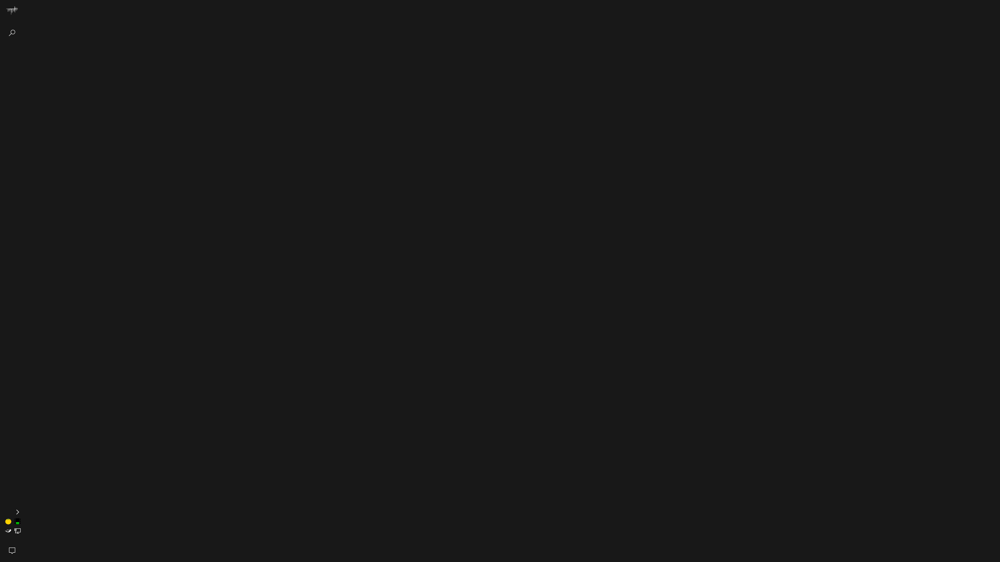

# Bloodborne Caryll Runes

[![CC BY-SA 4.0][cc-by-sa-image]][cc-by-sa]

[cc-by-sa]: http://creativecommons.org/licenses/by-sa/4.0/
[cc-by-sa-image]: https://licensebuttons.net/l/by-sa/4.0/88x31.png
[cc-by-sa-shield]: https://img.shields.io/badge/License-CC%20BY--SA%204.0-lightgrey.svg

I copy the main steps of the PSD of [Start orb Mark of the hunter (Bloodborne) for Windows](https://vsthemes.org/en/icon/startorb/857-mark-of-the-hunter-bloodborne.html) that by [Elementary](https://vsthemes.org/en/user/Elementary/), the [cover](https://www.deviantart.com/bebelsh/art/Mark-of-the-hunter-732406069) by [bebelsh](https://www.deviantart.com/bebelsh).

Then I completed the other basic runes based on [Bloodborne Caryll Rune Vectors](https://www.deviantart.com/lolly535/art/Bloodborne-Caryll-Rune-Vectors-545838128) that by [lolly535](https://www.deviantart.com/lolly535).

And attach an additional [data table(中文)](data_translate.md) here. Refer to:

- [Caryi Runes](https://www.bloodborne-wiki.com/p/caryll-runes.html  )
- [《血源诅咒》 卡莱尔符文](https://gamegene.cn/wiki/133  )
- [血源 全符文效果及获取方式一览 符文怎么获取](https://www.gamersky.com/handbook/201504/557548.shtml)

If the location of your taskbar is different from mine, you may need to adjust it by yourself. Preview at 2560x1440 resolution:

## Tools Used

- Photoshop
- [pngtosvg](https://www.pngtosvg.com)